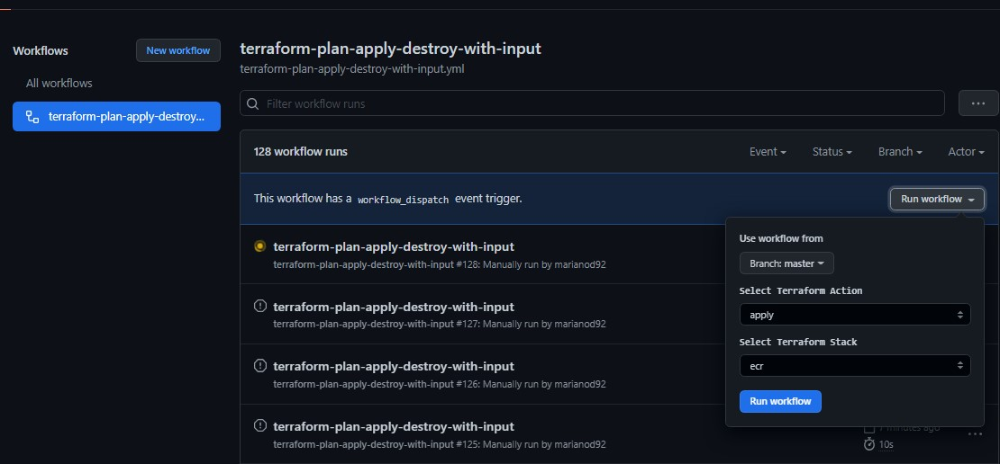

# DevOps Challenge

## Description
### Objective
[Nakama by Heroic Labs](https://heroiclabs.com/) is a scalable game-server for social and real-time games. The objective is to run the Nakama server on an EKS cluster supported by any database supporting Postgres protocol on AWS infrastructure.

### Requirements
The EKS cluster should be able to pull a docker image of the configuration and custom scripts from AWS ECR and start the    Nakama pod.
 - Run Nakama on an EKS cluster (single node, as multiple nodes, aren't supported by the open-source version).
 - Host a database to support the Nakama server.
 - The current configuration required is for a development environment that can be later ported for other environments.
 - Brownie points for pipeline automation.
 

### Integration Test
 - Unity project should be able to connect to the server (needs DNS name or public IPv4 to connect to the server from Unity).
 - Access to the Nakama console on port 7451.

### References 
- [Nakama Server Configuration](https://heroiclabs.com/docs/nakama/getting-started/configuration/)

--
## Tech : Hands-On!

### Pre-Requisites
- [Terraform]
- [aws-cli]
- [Docker]
- [kubectl]
- [helm]

## Deploy Infraestructure Layers

### From local workspace (manual mode)
#### ECR 

```sh
cd /devops/terraform/nakama/ecr
terraform init
terraform plan
terraform apply
```

#### VPC
```sh
cd /devops/terraform/nakama/vpc
terraform init
terraform plan
terraform apply
```

#### EKS
```sh
cd /devops/terraform/nakama/eks
terraform init
terraform plan
terraform apply
```

## From CICD (Github Actions Mode)



 

In the Actions > terraform-plan-apply-destroy-with-input section

You can hit Run Workflow, select the desired Terraform action, and then the Stack:

Actions:
- Plan: terraform plan
- Apply: terraform apply
- Destroy: terraform destroy
- Outputs: show Nakama Server URL

Stacks:
- ECR
- EKS
- VPC

You just need to execute in this order

- 1: Apply : VPC

- 2: Apply : EKS

At the end of the execution of Apply : EKS, you will be able to observe in the Get URL step of the Pipeline the Endpoint to connect to the Nakama Administration Console:


